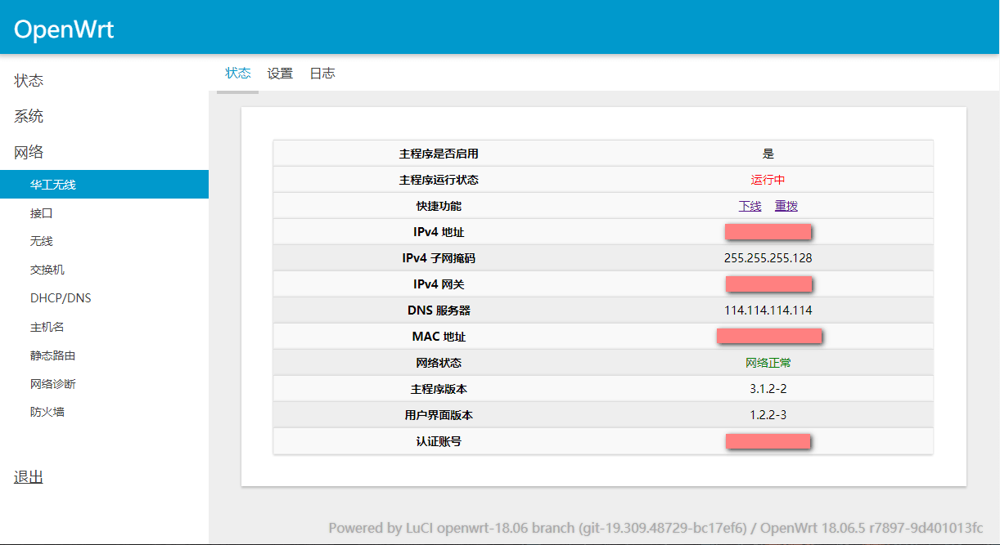
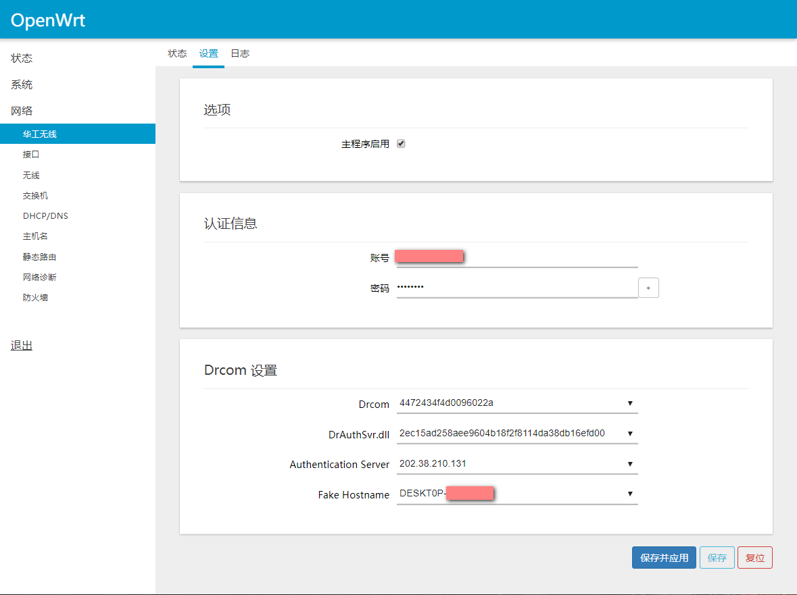
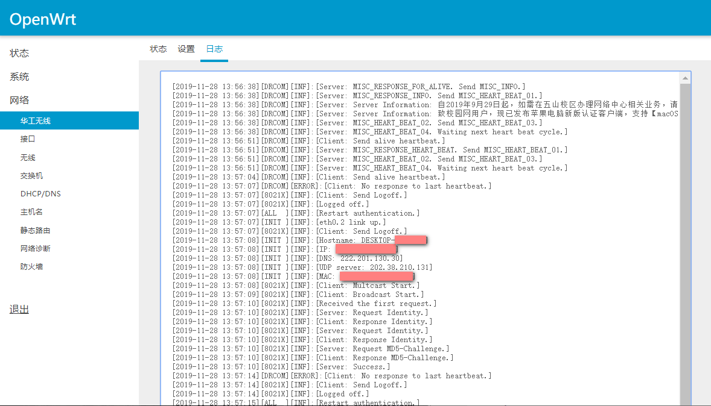
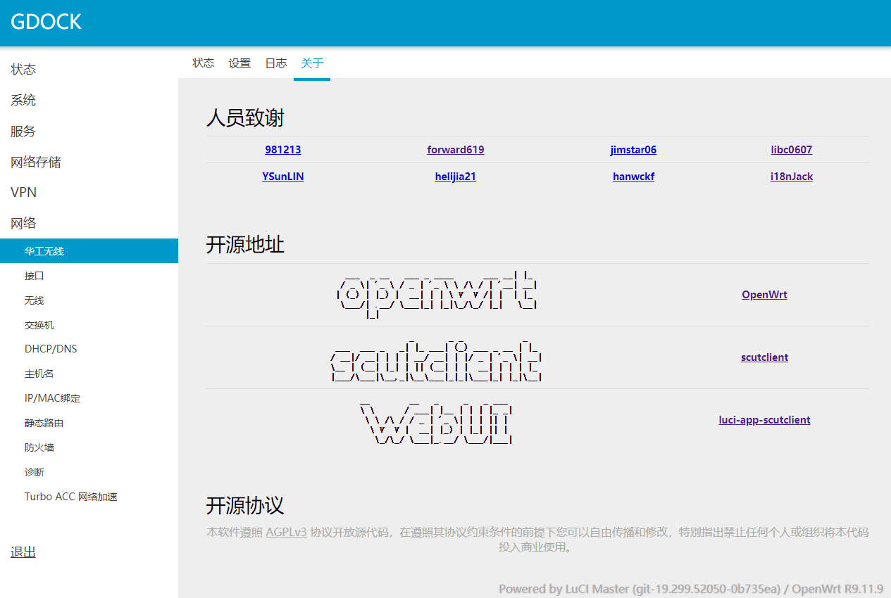

# 简介
本仓库将原先 `feeds/luci` 编译 luci 应用的方式改为 `package` 类 luci 应用编译的方式。

原软件包文件结构：
```
│ Makefile
├─luasrc
│  ├─controller
│  │      scutclient.lua
│  ├─model
│  │  └─cbi
│  │      └─scutclient
│  │              scutclient.lua         
│  └─view
│      └─scutclient
│              about.htm
│              logs.htm
│              status.htm        
└─root
    └─etc
        └─uci-defaults
                luci-scutclient
```


新软件包文件结构：
```
│ Makefile
├─files
│  ├─luci
│  │  ├─controller
│  │  │      scutclient.lua  
│  │  ├─model
│  │  │  └─cbi
│  │  │      └─scutclient
│  │  │              scutclient.lua           
│  │  └─view
│  │      └─scutclient
│  │              about.htm
│  │              logs.htm
│  │              status.htm        
│  └─root
│      └─uci-defaults
│              luci-scutclient
```

## 安装到路由器
到 [发布页](https://github.com/ploxolg/luci-app-scutclient/releases/latest) 下载 `ipx` 安装文件，用 WinSCP 拖到路由器 `tmp` 目录下，通过如下命令安装：
```
opkg install luci-app-scutclient_2.0.1-0_all.ipk
```
注：安装前请先安装 scutclient.
### 效果预览





## LuCI 应用编译
参考 [Quick Image Building Guide](https://openwrt.org/docs/guide-developer/quickstart-build-images) 和 [How to Build a Single Package](https://openwrt.org/docs/guide-developer/single.package)

下面使用 Ubuntu 18.04 为例.
### 下载 OpenWrt 源码
```
sudo apt install subversion g++ zlib1g-dev build-essential git python python3
sudo apt install libncurses5-dev gawk gettext unzip file libssl-dev wget
sudo apt install libelf-dev ecj fastjar java-propose-classpath
sudo apt install build-essential libncursesw5-dev python unzip

git clone https://github.com/openwrt/openwrt.git
cd openwrt
./scripts/feeds update -a
./scripts/feeds install -a
```
### 拉取应用源码
```
wget -P package/scutclient https://raw.githubusercontent.com/scutclient/scutclient/master/openwrt/Makefile
git clone git@github.com:i18nJack/luci-app-scutclient.git
cp -r luci-app-scutclient package/luci-app-scutclient
./scripts/feeds install -a
```

### 编译 package
```
make tools/install
make toolchain/install

make menuconfig
make package/luci-app-scutclient/compile V=99
```

编译完成后，可以到 `openwrt/bin` 对应架构的 `base` 目录下查找 `scutclient` 和 `luci-app-scutclient` 的 `ipk` 安装文件。

## 使用 SDK 编译
下面以 `mt7620`  [pandorabox](https://downloads.pangubox.com/pandorabox/) 固件在 Ubuntu 18.04 上编译为例，其它架构替换相应 SDK 文件即可。

```
sudo apt install subversion g++ zlib1g-dev build-essential git python python3
sudo apt install libncurses5-dev gawk gettext unzip file libssl-dev wget
sudo apt install libelf-dev ecj fastjar java-propose-classpath
sudo apt install build-essential libncursesw5-dev python unzip
```

### 下载 SDK 文件到本地
```
wget  https://downloads.pangubox.com/pandorabox/19.01/targets/ralink/mt7620/PandoraBox-SDK-ralink-mt7620_gcc-5.5.0_uClibc-1.0.x.Linux-x86_64-2018-12-31-git-4b6a3d5ca.tar.xz
```

### 解压 SDK
```
tar -xf PandoraBox-SDK-ralink-mt7620_gcc-5.5.0_uClibc-1.0.x.Linux-x86_64-2018-12-31-git-4b6a3d5ca.tar.xz
mv PandoraBox-SDK-ralink-mt7620_gcc-5.5.0_uClibc-1.0.x.Linux-x86_64-2018-12-31-git-4b6a3d5ca mt7620
cd mt7620
```
### 拉取应用源码
```
wget -P package/scutclient https://raw.githubusercontent.com/scutclient/scutclient/master/openwrt/Makefile 
git clone git@github.com:i18nJack/luci-app-scutclient.git cp -r luci-app-scutclient package/luci-app-scutclient 
./scripts/feeds install -a
```
### 勾选应用并编译独立文件
```
make menuconfig
make package/luci-app-scutclient/compile V=99
```

相比使用源码编译不用再单独编译工具链了
